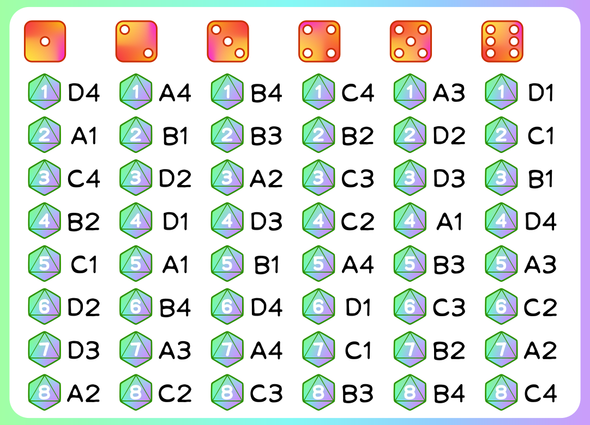

# [Chameleon](chameleon.html)

### AIM

To unmask the Chameleon without giving away the secret word. If you are the Chameleon then your mission is to blend in with the other players, avoid detection and work out the secret word.

### PREP

Gather 4-6 players. Shuffle the Blue Chameleon Card into the matching set of Code Cards and deal one to each player, face down. One of you is now the Chameleon. Stay cool, blend in and don't get caught.

### THE HUNT BEGINS...

The dealer turns over a Topic Card for all to see and rolls the yellow and blue dice. The two numbers on the dice lead everyone (except the Chameleon) to a secret coordinate on their Code Card. This coordinate is then used to locate the secret word on the Topic Card in front of them.

### UNMASKING THE CHAMELEON

Once everyone has said their word, begin debating the Chameleon's identity. This is where you get to channel your inner attorney and pick holes in each other's arguments. After a few minutes, everyone votes by pointing at the person they think is the Chameleon.

The player with the most votes must now turn over their card *(if two players receive an equal number of votes, the dealer for that round gets the deciding vote)*. If it's a Code Card, you've accused the wrong player and the Chameleon has escaped. Idiots! If it's a Chameleon Card, then you've successfully cornered the Chameleon... but it's not over yet. The Chameleon can still take a guess at the secret word. If they get it right, they escape.

The Chameleon for that round is now the dealer for the next. First switch decks, mix the Green Chameleon Card and matching set of Code Cards up and deal them out. It's time to track down that elusive Chameleon once again.

### MORE OR FEWER PLAYERS?

**3 PLAYERS**

An easy rule change is that the Chameleon, if caught, gets two guesses at the secret word.

**7 OR 8 PLAYERS**

Another simple change. Once everyone has said their word, have the dealer turn the Topic Card face-down to make it harder for the Chameleon to work out the secret word.

### SCORING (optional)

If you want to prove once and for all who's the best player around, you'll need to keep score.

Here's a simple scoring guide:

- If the Chameleon escapes undetected:
  - The Chameleon scores 2 points.
  - Everyone else scores O points.
- If the Chameleon is caught (but guesses the secret word):
  - The Chameleon scores 1 point.
  - Everyone else scores O points.
- If the Chameleon is caught (and doesn't guess the secret word):
  - The Chameleon scores O points.
  - Everyone else scores 2 points.

**The first player to 5 points wins.**

---

[PDF with cards](../img/chameleon-cards.pdf) to print

Chameleon cards

